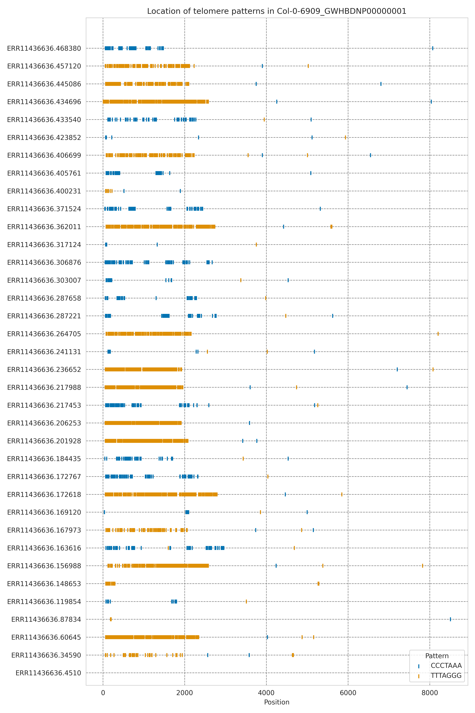
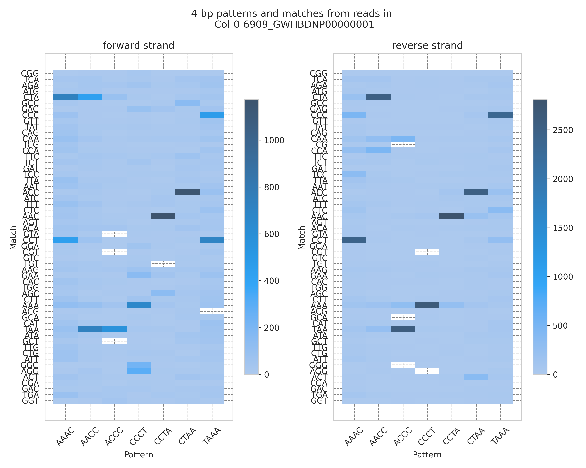
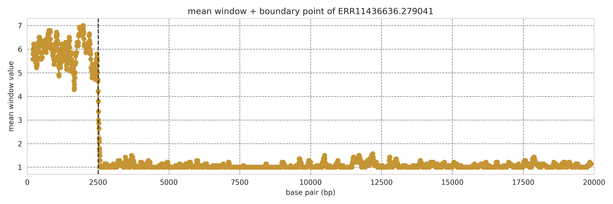

# Topsicle

This package is used to identify telomere boundary in long read sequencing (ONT and PacBio). 

Topsicle gets inputs in format as either fasta (or fasta.gz) or fastq (or fastq.gz), along with other parameters about telomere patterns (see section 2), then output with the length of each read within that input file in a .csv file and supplemental plots. 

## 0. Table of contents

* [1. Getting started](#1-getting-started)
  * [From source (GitHub)](#11-from-source-github)
  * [Install requirements](#12-install-requirements)
* [2. Usage](#2-usage)
  * [Descriptive plots - overview_plot.py](#21-descriptive-plots---overview_plotpy)
  * [Telomere length finding - main.py](#22-telomere-length-finding---mainpy)
  * [Flags](#23-flags)
  * [Brief explanation of Topsicle workflow](#24-brief-explanation-of-topsicle-workflow)
* [3. Troubleshooting](#3-troubleshooting)

## 1. Getting started

Let's get started with cloning this package from GitHub: 

### 1.1. From source (GitHub)

Make new environment for this package 
```bash
python3 -m venv Topsicle   # python version = 3.6.8
source ./Topsicle/bin/activate
# update pip if necessary 
pip install --upgrade pip

```

Cloning the package: [Topsicle](https://github.com/jaeyoungchoilab/Topsicle.git)

```bash
git clone https://github.com/jaeyoungchoilab/Topsicle.git # clone repo
cd Topsicle

# verify the cloning process: 
python3 main.py -h
```

### 1.2. Install requirements 
``` bash
pip install -r requirements.txt
```

Make sure that we installed dependents in the **requirements.txt** files, but maybe need to install cython manually.

To mannually install those packages instead of using requirement file:

``` 
biopython>=1.75
cython >=0.29.21 # install cython so we can install ruptures 
matplotlib==3.3.4
matplotlib-inline==0.1.6
numpy==1.22.4
pandas>=2.2.0
ruptures==1.1.9
seaborn==0.11.2
```
Topsicle was developed in Python 3.6, but also passed tests in Python versions 3.10 and 3.12. 

## 2. Usage 

Using Topsicle, you can have an overview of where are telomere patterns within the sequence with [overview_plot.py](#21-descriptive-plots---overview_plotpy), or jump right into the main analysis to get telomere lengths in reads using [main.py](#22-telomere-length-finding---mainpy).  

The full directory with code and results are in [Topsicle_demo](Topsicle_demo). After running it, it will return a .csv file (telolength_all.csv) for all telomere length of reads in the input (Topsicle will write the result to this .csv file in real time), descriptive plots, heatmaps and mean window change visualizations.

### 2.1: Descriptive plots - overview_plot.py
This code will output overview plot of locations of telomere pattern (or snippet of telomere pattern) in the sequence and heatmap. Run the code as below:

```bash
python3 overview_plot.py \
  --inputDir "$input_dir" \
  --outputDir "$output_dir" \
  --pattern $telo_pattern \
  --minSeqLength 9000 \
  --telophrase 4 \
  --recfindingpattern
```

**Descriptive plot** (of first 30 reads in chromosome 1): 



**Heatmap:**




### 2.2: Telomere length finding - main.py
Output a .csv file containing read ID and telomere length of each read for all the reads in that inputDir which passed basic filtering (>9kbp).

The script can be run from the command line as below, as an example of using all flags, which will output:
- a [.csv file](Topsicle_demo/telolengths_all.csv) with file number, IDs of reads in that file, and telomere length (default, always output this)
- [plots](Topsicle_demo/result_all/plot_4_1.png) of mean window changes and boundary points for each read tail, either start or end tail or both (flag --plot).
- a [.csv file](Topsicle_demo/result_all/rawcount_4_1.csv) of rawcount to know what specific patterns contribute to the mean window changes (flag --rawcountpattern)

```bash
python3 main.py \
  --inputDir "$input_dir" \
  --outputDir "$output_dir" \
  --pattern $telo_pattern \
  --minSeqLength 9000 \
  --telophrase 4 \
  --cutoff 0.4 \
  --windowSize 100 \
  --slide 6 \
  --trimfirst 200 \
  --maxlengthtelo 20000 \
  --plot \
  --rawcountpattern
```

**Mean window change plot** of one read in chromosome 1:




### 2.3: Flags and explanations: 

```
  -h, --help            show this help message and exit
  --inputDir INPUTDIR   Path to the input folder directory
  --outputDir OUTPUTDIR
                        Path to the output folder directory
  --pattern PATTERN     Telomere pattern, in human, TTAGGG
  --minSeqLength MINSEQLENGTH
                        Minimum of long read sequence, default = 9kbp
  --rawcountpattern     Print raw count of number of times see that pattern in
                        each window
  --telophrase TELOPHRASE [TELOPHRASE ...]
                        Step 1 - Length of telomere cut, can be 4 or 5 or so
                        on
  --cutoff CUTOFF       Step 1 - Cutoff of TRC value to have telomere
  --windowSize WINDOWSIZE
                        Step 2 - Window size for sliding
  --slide SLIDE         Step 2 - Window sliding step
  --trimfirst TRIMFIRST
                        Step 2 - Trimming off first number of base pair in
                        case of adapter
  --maxlengthtelo MAXLENGTHTELO
                        Step 2 - Longest value can be for telomere or sequence
  --plot                Step 2 - Plot of changes in mean window and change
                        point detected, boolean, presence=True
```

Note: Because we only want to have a brief understanding of how Topsicle works, hence, the [Topsicle_demo](Topsicle_demo) just contains A thaliana Col-0 reads that are aligned to chromosome one 3-prime of reference genome, with one result from each analysis (descriptive plot,... - see the folder for more details). We should note that when running Topsicle, it might return more files than just 5 files as in the Demo folder. 

### 2.4: Brief explanation of Topsicle workflow 
1. We have an initial pattern that we want to look for (for example, the telomere pattern of Arabidopsis thaliana Col-0 strand is "CCCTAAA"). Since this desired pattern has 7 base pairs (7-bp), and long read sequence methods (Oxford Nanopore Technologies, PacBio HiFi,...) can have random sequencing errors, identifying a k-mer (a subset) of that 7-bp pattern will be less specificity than finding whole 7-bp. Pocky generates phrases of that strand to the length we want, for example 4-bp or 5-bp from 7-bp (--telophrase). Let's call them "k-mer patterns". 
2. [Optional step 0](#21-descriptive-plots---overview_plotpy): Overview descriptive plot to see if input read has telomere or not by marking location of telomere pattern found in that read. This step can also get heatmap for general observation of tandem repeat we can expect to see and interpret if the analysis goes wrong at any point.
3. [Step 1](#22-telomere-length-finding---mainpy): If that read has telomere at 5' end, first 1000bp should also have telomere-phrase patterns there. Checking first 1kbp will have the proportion of telomere-phrase patterns (TRC value), and the read will be marked as having telomere if its TRC value is larger than the TRC cutoff value (--cutoff). 
4. [Step 2](#22-telomere-length-finding---mainpy): After identifying which read has telomere, Topsicle finds how long is that telomere by sliding (--slide) through window (--windowSize), counting the mean of number of patterns found within that window, and returning the boundary point between telomere and non-telomere region as the window with the mean value drops significantly. 
5. Optional step 3: If we want to know what kmer-bp pattern (kmer < initial length of telomere pattern), we use the flag --rawcountpattern to return a .csv file with location of window start, pattern, number of pattern in that window. 

## 3. Troubleshooting

### 3.1. The code runs but no output
1. Check pattern
The pattern input is recommended to be the pattern at 5 prime of the read. For example, in Col-0 A.thaliana, this pattern should be 'CCCTAAA' (telomere pattern found at 5 prime), not 'TTTAGGG' (telomere pattern found at 3 prime). This is to prevent any unwanted results 

2. Check flags and input 
Sometimes, input can be missing or in wrong format, and the code will not have any output then. Missing flag can be a reason for not being able to run as well.

### 3.2. Run out of memory 
1. Check if you printed out so many plots or not (--plot)
2. Double check the memory allowance 

### 3.3: Not enough resources
This issue usually appears when running whole genome analysis but use less than 6 cores in 24 hours for testing file that is more than 5GB and/or more than 1 million reads (observations based on testing trials on KU HPC)
1. It is recommended to have more resources allocate - maybe more core, more time or other resources. If possible, breaking down the file into several 1GB and/or 0.2 millions reads files, then submit several jobs and put them together can also help. 
2. If the analysis keeps cancelled after several attempts and we do not need whole genome analysis, please keep in mind that the telolength_all.csv might not contain every reads with telomere and their length, since the analysis was stopped. 


