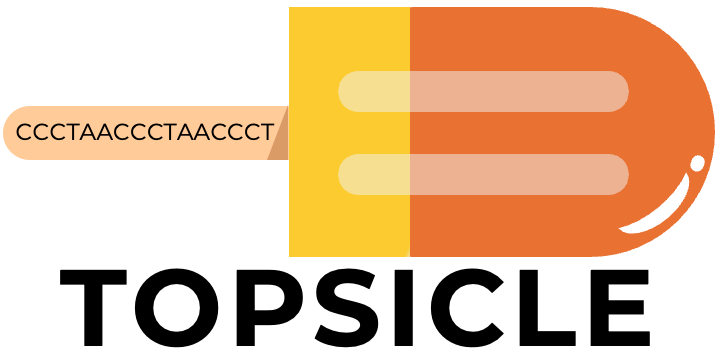
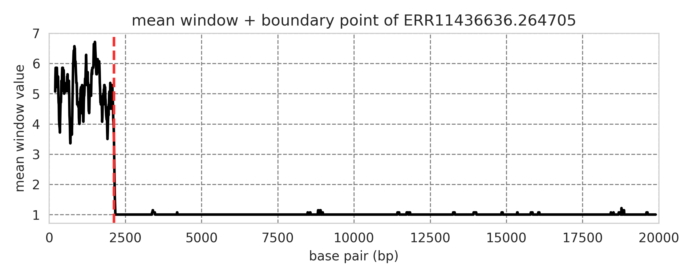
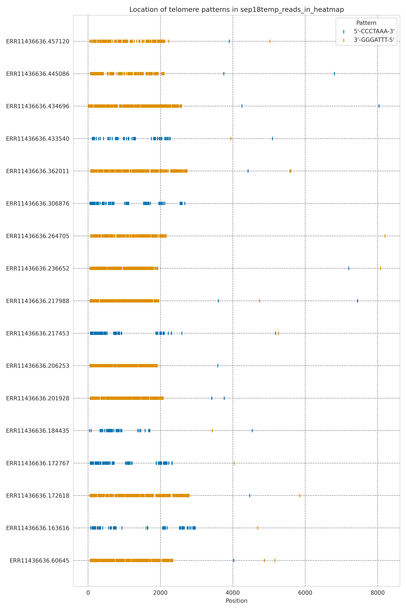
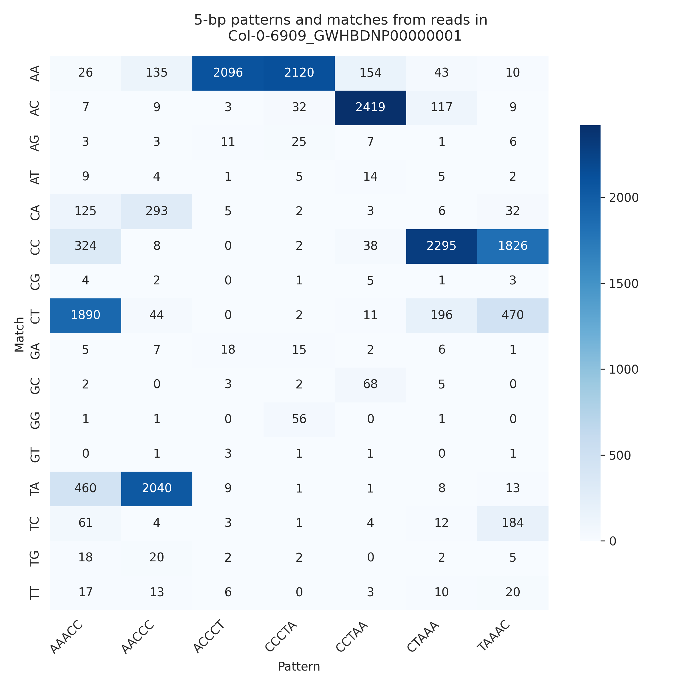

This package is used to identify telomere boundaries and length using long-read sequencing data from ONT or PacBio platforms. 

Topsicle can analyze fasta or fastq data and outputs the estimated telomere length in a .csv file and can generate optional supplemental plots. 

## Table of contents

* [1. Getting started](#1-getting-started)
* [2. Running Topsicle](#2-running-topsicle)
  * [2.1.1 Quick example of running Topsicle](#211-quick-example-of-running-topsicle)
  * [2.1.2 Detailed explanation of running Topsicle](#212-detailed-explanation-of-running-topsicle)
  * [2.1.3 Explanation of output](#213-explanation-of-output)
  * [2.2. Plotting and visualization of raw data(Optional)](#22-plotting-and-visualization-of-raw-data-optional)
  * [2.3. Topsicle workflow](#23-topsicle-workflow)
* [3. Troubleshooting](#3-troubleshooting)

## 1. Getting started

Topsicle is written in Python 3.6, but tested in Python 3.10 and 3.12 versions.

### 1.1. From source (GitHub)

Make a new environment for this package 
```bash
python3 -m venv Topsicle   # minimum python version required is 3.6.8
source ./Topsicle/bin/activate
# update pip if necessary 
pip install --upgrade pip

```

Cloning the package [Topsicle](https://github.com/jaeyoungchoilab/Topsicle.git):

```bash
git clone https://github.com/jaeyoungchoilab/Topsicle.git # clone repo
```

### 1.2. Install requirements 
``` bash
cd Topsicle
pip install -e .
```

With upcoming [pip update](https://github.com/pypa/pip/issues/11457), cython might requires to be installed manually. Also, to manually install dependencies:

``` 
biopython>=1.75
cython>=0.29.21 
matplotlib>=3.3.4
matplotlib-inline>=0.1.6
numpy>=1.22.4
pandas>=2.2.0
ruptures==1.1.9
seaborn>=0.11.2
```

Verify the installation:
```bash
topsicle --help

## can also call the main.py file to run Topsicle
# python3 Topsicle/main.py --help
```

## 2. Running Topsicle 

### 2.1.1: Quick example of running Topsicle

General example:
```bash
topsicle \
  --inputDir $input_dir \
  --outputDir $output_dir \
  --pattern $telo_pattern
```

Demo file example:
```bash
topsicle \
  --inputDir Topsicle_demo/data_col0_teloreg_chr \
  --outputDir Topsicle_demo/result_temp \
  --pattern AAACCCT
```
[Topsicle_demo](Topsicle_demo) contains *A. thaliana* Col-0 reads from chromosome 1R reference genome (TAIR10, GCF_000001735.4). 

Topsicle will output: 
- a .csv file (telolength_all.csv) with the telomere lengths of each input reads passing the filtering parameters.
- a quadratic fit plot to predict optimal TRC (Telomere Repeat Count statisitcs, which reflects how confident Topsicle is in identifying whether a read was sequenced from the telomere) threshold and corresponding telomere length.

### 2.1.2: Detailed explanation of running Topsicle

Detailed example run:
```bash
topsicle \
  --inputDir $input_dir \
  --outputDir $output_dir \
  --pattern $telo_pattern \
  --minSeqLength 9000 \
  --telophrase 4 \
  --cutoff 0.4 \
  --windowSize 100 \
  --slide 6 \
  --trimfirst 200 \
  --maxlengthtelo 20000 \
  --plot \
  --rawcountpattern \
  --threads 20 \
  --override
```

Explanation of each parameter (run topsicle --help):

| Flag                | Type      | Description                                                                                       |
|------------------------------|-----------|---------------------------------------------------------------------------------------------------|
| -h, --help                   |           | Show this help message and exit                                                                    |
| --inputDir, -i               | FILE/FOLDER | Required, Path to the input file or directory                                                     |
| --outputDir, -o              | FOLDER    | Required, Path to the output directory                                                            |
| --pattern                    | CHAR      | Required, Telomere repeat sequence (in 5' to 3' orientation). For e.g., in human use CCCTAA                           |
| --minSeqLength               | INT       | Minimum length of a long read sequence that will be analyzed (default: 9000)                              |
| --rawcountpattern            |           | Output raw count of the k-mer for each window (default: False)                             |
| --telophrase                 | INT [INT ...] | Length of telomere k-mer to search. By default will use telomere k-mer length minus 2 (default: None)            |
| --cutoff                     | FLOAT [FLOAT ...] | TRC statistics threshold (default: 0.7)                        |
| --windowSize                 | INT       | Sliding window size (default: 100)                                                                |
| --slide                      | INT       | Window sliding step. Default is telomere k-mer length (default: None)                           |
| --trimfirst                  | INT       | Length of intial number of base pairs to trim (default: 100)                          |
| --maxlengthtelo              | INT       | Longest possible length of telomere for any given read (default: 20000)                              |
| --plot                       |           | Optional, generate plot showing for each telomere read the abundance across the sequencing reead and the change point (default: False)                         |
| --rangecp                    | INT       | Optional, set range of changepoint plot for visualization, default is maxlengthtelo (default: None)         |
| --read_check                 | STR       | Optional, get telomere of a specific read (default: None)                                                   |
| --override, -ov              |           | Override telolengths_all.csv file but keep subset fastq (default: False)                                                             |
| --threads, -t                | INT       | Number of CPU cores to use (default: all available cores)                                                   |

### 2.1.3 Explanation of output
Topsicle will output a .csv file containing the read ID and telomere length of all reads in the --inputDir that passed filtering.

#### Quick summary
Main outputs of interest.
- [$telolengths_all.csv](Topsicle_demo/telolengths_all.csv): Output file with file number, IDs of reads in that file, and telomere length.
- [$output.fastq](Topsicle_demo/result_justone/Col-0-6909_GWHBDNP00000001.1_nano_right.fastq_trc_over_0.4.fastq): Reads that passed TRC threshold.
- [$log file](Topsicle_demo/result_justone/topsicle_run.log): Prints input parameter values and output logs.
- [$quadratic fit plot](Topsicle/Topsicle_demo/quadfit_5mer_CCCTAAA.png): Quadratic plot of Telomere Repeat Count values (x-axis) and telomere length (y-axis). Red line shows the line of best fit using a quadratic model and green dot is where change in telomere length estimates is lowest.

Additional optional outputs based on flags: 
- [$read.png](Topsicle_demo/result_justone/plot_4_1.png): Plot showing mean telomere repeat count by window and the telomere-subtelomere boundary point for each read (flag **--plot**).
Example **mean window change plot** of a sequencing read:

The red line indicate the estimated telomere-subtelomere boundary point.

- [$read.csv](Topsicle_demo/result_justone/rawcount_4_1.csv): Raw count output used for calculating the sliding window and mean telomere repeat count (flag **--rawcountpattern**)

#### Detailed summary
Example output: [$telolengths_all.csv](Topsicle_demo/telolengths_all.csv) 

Main output of Topsicle and updates in real time while Topsicle is running. 
- file_number: Name of the input file(s) in the directory.
- phrase: The phase of the k-mer used for searching. By default, if the telomere pattern is 6-bp long, Topsicle will find 4-mer patterns (phrase = 4).
- trc: Telomere repeat count value of that read. This statistics is used for determining reads sequenced from the telomere (see the publication). 
- readID: ID of read.
- telo_length: Estimated telomere length of read.

Additional log file: [$output.log](Topsicle_demo/log_topsicle_demo.log)
- Information about resources used (number of cores, time, location of output)
- Real-time update
- Hard-choice TRC cutoff and median of telomere length if using this cutoff (line 11)
- Asymptotic TRC cutoff (line 12) and corresponding median telomere length (line 13). The asymptotic TRC is recommended if a hard-choice TRC cutoff can not be initially determined. 
=======

If there is no line with "**All telomere found, have a nice day**" then Topsicle did not examine all possible reads in the raw data. The user can rerun the process or pick up the previous run by analyzing the smaller dataset containing reads that potentially have telomeres, called *Temporary fasta file*, as in line 8 of the demo log file. 

It is recommended to provide more resources and have a strict TRC cutoff value as well (any TRC > 0.7 will be strict). Also see section [3. Troubleshooting](#3-troubleshooting). 

### 2.2: Plotting and visualization of raw data (Optional)
Plot telomere k-mer matches in the sequencing read and a heatmap counting the different phases of the telomere k-mer. We recommend to use as input data the reads that have passed the filters from Topsicle and used for estimating the telomere length.

As a note, this option is not developed to be called directly yet, so we still need to call it using python3 $TOPSICLE_PATH/overview_plot.py as below:

```bash
python3 overview_plot.py \
  --inputDir "$input_dir" \
  --outputDir "$output_dir" \
  --pattern $telo_pattern \
  --minSeqLength 9000 \
  --telophrase 4 \
  --recfindingpattern \
  --rawcount
```

**Descriptive plot** displaying telomere repeat counts in the first 40 reads: 



**Heatmap** displaying telomere repeat count by telomere k-mers of different phases:




### 2.3: Topsicle workflow 

1. We have a telomere pattern that we want to identify length (for example, the telomere pattern of Arabidopsis thaliana Col-0 strand is "CCCTAAA"). Since the initial telomere pattern has 7 base pairs (7-bp) and long read sequence methods (Oxford Nanopore Technologies, PacBio HiFi,...) can have  sequencing errors, identifying a k-mer (a subset) of that 7-bp pattern will be less specific than finding the whole 7-bp. Topsicle generates k-mers (or phrases, or subsets) of that pattern, by default, 5-bp from a 7-bp (--telophrase). Let's call them "k-mer patterns" and perform analysis on them. 

The user can provide the most abundant pattern from tools such as Tandem Repeats Finder, tidk, or by checking reads that align to the chromosome ends of the reference genome, which are likely to have telomere. Topsicle can also recognize the k-mer pattern by itself, by using the flag --recfindingpattern, see [Optional visualization step](#22-plotting-and-visualization-optional). Also see [3.0. Telomere pattern tips](#30-telomere-pattern-tips).

User can provide multiple telomere patterns by using the pipe ("|"), such as "AAACCCG|AAACCG", but this feature is not fully tested in this version yet. 

2. [Optional visualization step](#22-plotting-and-visualization-optional): This step provides an initial visual analysis of the input sequences.

This optional step is used to see if the input reads contain the telomere repeat. It will return plots with the location of the telomere pattern found in that read. A heatmap can also be generated for observation of tandem repeats that we can expect to have in the dataset. By default, it will return a description plot of positions of k-mer patterns for a read, and in addition, using -recfindingpattern option will generate a heatmap (k-mer profile) and let us know which k-mer from the telomere pattern is abundant and what errors are commonly found within this read. Along with the heatmap, the parameter -rawcount will extract the count of each k-mer and its match in case we want to know exactly how many matches are at each position. 

It is advised to run this supplemental function prior to running the main function to have an overview of observations of species and their reads before finding the telomere length.  

**Executing Topsicle**

3. Step 1. TRC filtering: If read is sequenced from the telomere, the first 1000bp of that read should contain telomere repeat k-mers. The count of this initial telomere repeat k-mers (i.e., TRC statistics) will be used for filtering candidate telomere sequencing reads. Reads with a threshold TRC value (--cutoff) will be analyzed for downstream. In case a threshold can't be determined, Topsicle can calculate an automatic threshold using the asymptotic method (see manuscript for details) and calculate the telomere length.

4. Step 2. Telomere length calculation: After identifying potential read that has telomere, Topsicle finds how long is that telomere by sliding (--slide) through window (--windowSize) and measuring the mean of number of patterns found within that window, and returning the boundary point between telomere and non-telomere regions based on changepoint algorithm.

5. Optional step 3: If we want to know what kmer-bp pattern is most found within a window (kmer has to smaller than initial length of telomere pattern), we use the flag --rawcountpattern to return a .csv file with position of window start, pattern, and number of pattern found in that window. 

7. See [2.1.3 Explanation of output](#213-explanation-of-output) for output explanations

## 3. Troubleshooting

### 3.0. Telomere pattern tips

Telomere repeat sequence that will be searched in the long read data need to be in 5' to 3' orientation. In addition it assumes the subtelomere is in the 3' end.

For example if input telomere pattern for -pattern parameter is **AACCCT** (i.e. mammalian telomere sequence) it assumes the following telomere sequence structure

5' AACCCTAACCCTAACCCTAACCCTAACCCTAACCCTNNNNNNNNNNNNNNNNNNNNNNNNN 3' (subtelomere)

and

3' (subtelomere)
NNNNNNNNNNNNNNNNNNNNNAGGGTTAGGGTTAGGGTTAGGGTTAGGGTTAGGGTTAGGG  5'

Here are example telomere sequences that were used as input sequence in our published study:

- Human: CCCTAA 
- A. thaliana: AAACCCCT
- Mimulus verbenaceus: AAACCG 

We highly recommend the user to generate [heatmap profile](#22-plotting-and-visualization-of-raw-data-optional) and check the input telomere sequence.


### 3.1. The code runs but no output

1. Check telomere pattern 

See [3.0. Telomere pattern tips](#30-telomere-pattern-tips) for details.

2. Check flags and input:

Sometimes, input can be missing or in the wrong format, and the code will not have any output then. A missing flag can be a reason for not being able to run as well. Providing a higher value of TRC (such as TRC > 0.6) can help, too. 

### 3.2. Run out of memory 
1. Check if you printed out so many plots or not (with the flag --plot)

2. Double-check the memory allowance 

### 3.3: Not enough resources
This issue usually appears when running whole genome analysis but using fewer than 6 cores in 24 hours for testing files that are more than 20GB and/or more than 1 million reads (observations based on testing trials on KU HPC)
1. It is recommended to have more resources allocated - maybe more core, more time, or both. If possible, breaking down the file into several 1GB and/or 0.2 million reads files, then submitting several jobs and putting them together can also help. 
2. Using a conservative TRC cutoff (for example, TRC > 0.7) can help reduce the number of reads that Topsicle has to analyze.
3. If the analysis keeps cancelling after several attempts, please keep in mind that even though Topsicle returns some results in the telolength_all.csv file, it might not look through and contain results from every read with telomere and their length. However, this file should provide some information. We also recommend submitting an issue request on GitHub if this keeps happening.

**Note:** It will echo **"All telomere found, have a nice day."** when Topsicle checked all reads in the dataset. It is highly recommended to have a log file and look for this line when running Topsicle on a big dataset.
